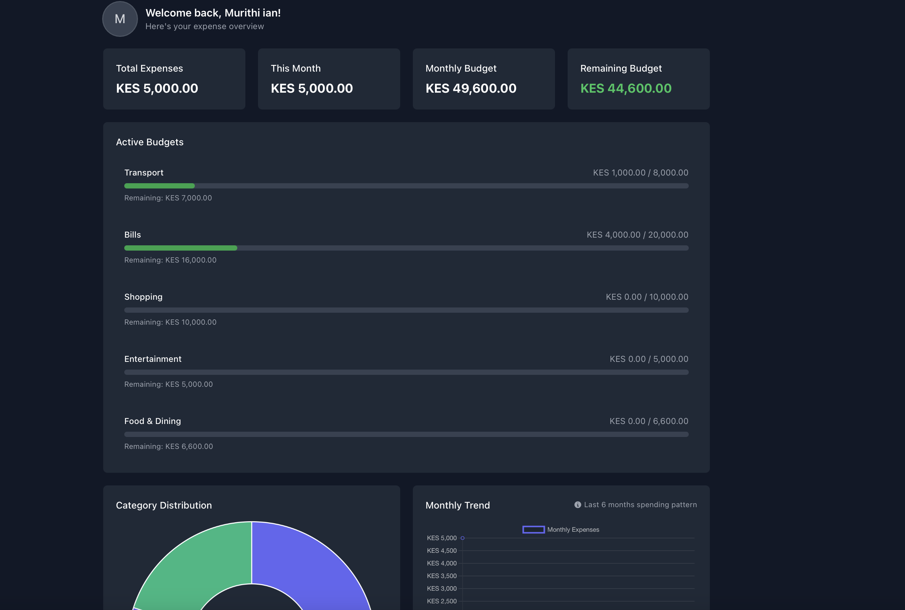
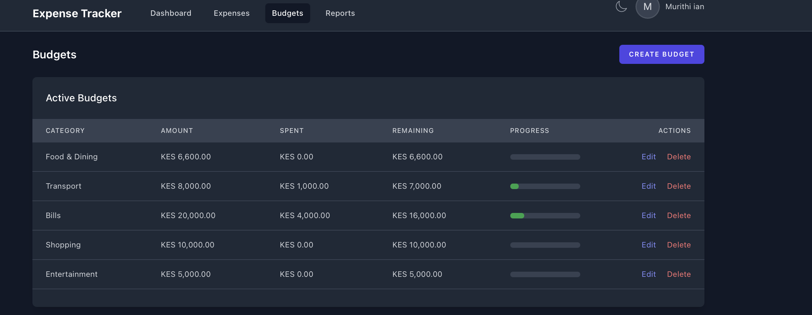
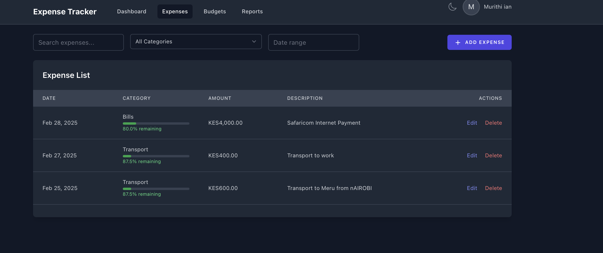
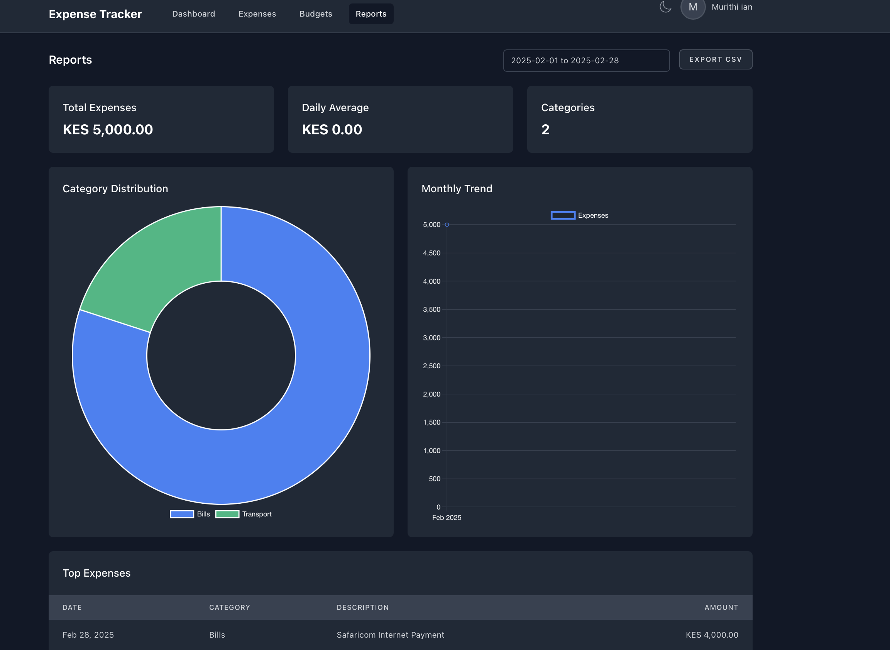

# Expense Tracker Application

<p align="center">

</p>

A modern expense tracking application built with Laravel 12, Livewire, and Tailwind CSS. Track expenses, manage budgets, and get insights into spending habits.

## 🚀 Features

- 📊 Dashboard with expense overview
- 💰 Budget management
- 📝 Expense tracking
- 📈 Reports and analytics
- 📧 Email notifications
- 🌓 Dark mode support
- 👤 User profile management
- 📱 Responsive design

## 🛠 Requirements

- PHP >= 8.1
- Composer
- Node.js & NPM
- PostgreSQL
- Gmail account (for email notifications)

## 📋 Prerequisites

### PostgreSQL Installation

#### On macOS
```bash
# Using Homebrew
brew install postgresql@15
brew services start postgresql@15
```

#### On Windows
1. Download PostgreSQL installer from [official website](https://www.postgresql.org/download/windows/)
2. Run the installer and follow the installation wizard

#### On Linux (Ubuntu/Debian)
```bash
sudo apt update
sudo apt install postgresql postgresql-contrib
sudo systemctl start postgresql
```

### Database Setup

1. Login to PostgreSQL:
```bash
psql -U postgres
```

2. Create database and user:
```sql
CREATE DATABASE your_database_name;
\c your_database_name

CREATE USER your_database_username WITH PASSWORD 'your_database_password';
GRANT ALL PRIVILEGES ON DATABASE your_database_name TO your_database_username;

-- Grant Schema Access
GRANT USAGE, CREATE ON SCHEMA public TO your_database_username;
ALTER DEFAULT PRIVILEGES IN SCHEMA public GRANT ALL ON TABLES TO your_database_username;
ALTER DEFAULT PRIVILEGES IN SCHEMA public GRANT ALL ON SEQUENCES TO your_database_username;
```

## 🚀 Installation

1. Clone the repository:
```bash
git clone https://github.com/IMDevv/Expense-tracker-app.git
cd expense-tracker-app
```

2. Install dependencies:
```bash
composer install
npm install 
```

3. Configure environment:
```bash
cp .env.example .env
php artisan key:generate
```

4. Update `.env` with database configuration:
```env
DB_CONNECTION=pgsql
DB_HOST=127.0.0.1
DB_PORT=5432
DB_DATABASE=expense_tracker
DB_USERNAME=your_database_username
DB_PASSWORD=your_database_password
```

5. Configure email settings in `.env`:
```env
MAIL_MAILER=smtp
MAIL_HOST=smtp.gmail.com
MAIL_PORT=587
MAIL_USERNAME=your_email@gmail.com
MAIL_PASSWORD=your_app_password
MAIL_ENCRYPTION=tls
MAIL_FROM_ADDRESS=your_email@gmail.com
```

6. Set up the application:
```bash
php artisan migrate
php artisan db:seed
php artisan storage:link
```

7. Start the development server:
```bash
npm run dev
php artisan serve
```

## 📧 Email Configuration

To enable email notifications:

1. Enable 2-Step Verification in your Google Account
2. Generate an App Password:
   - Go to Google Account Security settings
   - Select "App passwords"
   - Generate a new app password
   - Use this password in your .env file

## 📸 Screenshots

<details>
<summary>View screenshots</summary>

### Dashboard


### Budget Management


### Expenses


### Reports


</details>

## 🧪 Testing

Run the test suite:
```bash
php artisan test
```

## 👤 Default Login Credentials

After running the database seeds, you can use these default credentials to log in:

```
Email: ringier@example.com
Password: ringier@123$
```

> **Note**: Google OAuth is enabled as well for login and registration. Simply add your Google client ID and secret to the `.env` file.

